# Containerize and Set up CI/CD pipeline for the Dream Vacation App

This project contains the Dockerfile(s) for the frontend and backend of the Dream Vacations application, and orchestrated with Docker Compose for seamless local development and deployment. And the workflows for the continuous integration of the backend and frontend application set up.

A Continuous Deployment workflow was also added for the deployment of the application to AWS EC2 instance.

## Objectives

1. Containerize the Dream Vacation App using Docker and Docker Compose. By the end of this task, your application should run end-to-end using isolated, reproducible containers.
2. Set up the workflows for the continuous integration of both the backend and the frontend applications.
3. Set up the workflows for the continuous deployment of the application to an EC2 instance using docker compose.
4. Configure an EC2 instance with the network configuration.

### Tech Stack

1. Frontend: React.js
2. Backend: Node.js (Express or similar)
3. Containerization: Docker
4. Orchestration: Docker Compose

### Pre-requisites

1. Docker
2. Docker compose

## Containerization of the frontend and Backend Application

1. Clone the app

   ```bash
   git clone https://github.com/your-username/dream-vacations.git
   cd dream-vacations
   ```

2. Write the Dockerfile configuration to build both the frontend and backend docker images

* **Frontend Dockerfile**

  Configures and builds the React app into a production-ready container.
* **Backend Dockerfile**

  Sets up the Node.js server and prepares it to run inside a container.

3. Build and tag the image

   ```bash
   cd frontend
   docker buildx build -t <docker-repo>/<image-name> .
   cd backend
   docker buildx build -t <docker-repo>/<image-name> .
   ```

4. Write a `docker-compose.yaml` file to:

* Define both the frontend, backend and database services.
* Specify the ports for each service.
* Set up a shared Docker network to allow communication between the three containers.
* Set up a volume for the database to ensure data persists when the container stops working

5. Run the Application

   Docker Compose to build and run the containers

   ```bash
   docker compose up -d
   ```

## Continuous Integration Workflow

## Continuous Deployment Workflow

The workflow uses GitHub Actions to automatically deploy the backend and frontend to an EC2 instance using Docker Compose.

### Overview

This workflow:

a. Runs on push or pull requests to the dev branch (for specific paths).

b. Copies the latest code to the EC2 instance via SCP.

c. Creates a .env file on the EC2 instance with sensitive environment variables.

d. Deploys the updated services using Docker Compose.

### Workflow Trigger Conditions

The deployment is triggered when:

You push to the dev branch and modify:

.github/workflows/backend.yaml

.github/workflows/frontend.yaml

.github/workflows/deploy.yaml

docker-compose.yaml

Any file under backend/**or frontend/**

You open a pull request to dev affecting the same paths.

You manually trigger it via workflow_dispatch in GitHub Actions.

### How It Works

a. Checkout Code
   Pulls the latest commit from the repository.

b. Uses appleboy actions:

1. Uses appleboy/scp-action to copy the project to the directory /home/<EC2_USER>/dream-app
2. Uses appleboy/ssh-action to Create .env on EC2 and deploy the application
   Writes secrets (DB_USER, DB_PASS) into dierctory /home/<EC2_USER>/dream-app/.env. This environment is used by the docker-compose setup

   Uses Deploy with Docker Compose

   Pulls updated images (if any).

   Builds and runs the containers in detached mode.

## EC2 Instance and Network Configuration

The ec2 instance and the network requirements were configured using the AWS management console.

### Network Configuration

1. The VPC was configured with the name tag  dream-vpc and CIDR 10.0.0.0/16
   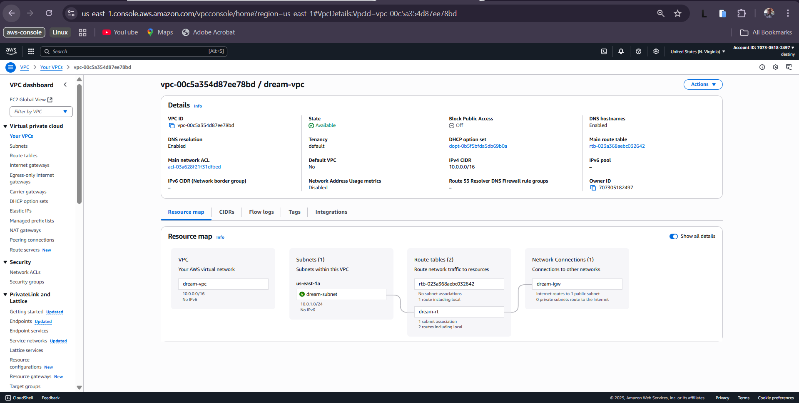
2. A subnet with the name tag dream-subnet in the VPC with CIDR 10.0.1.0/24
   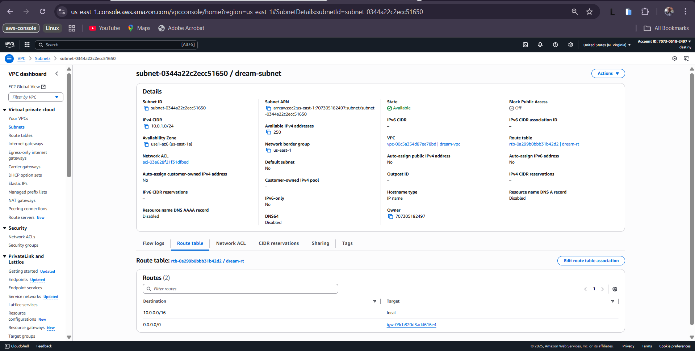
3. An internet gateway (dream-igw) was configured and attached to the dream-vpc.
   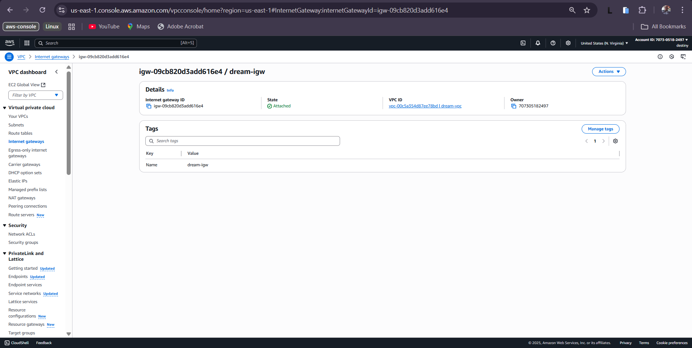
4. A route-table with the name tag dream-rt was configured and associated with the vpc (dream-vpc) and also with the dream-subnet.
5. A public route with destination 0.0.0.0/0 and target dream-rt was created in the dream-rt. This is to ensure that the subnet associated (dream-subnet) with the dream-rt is made a public subnet.
   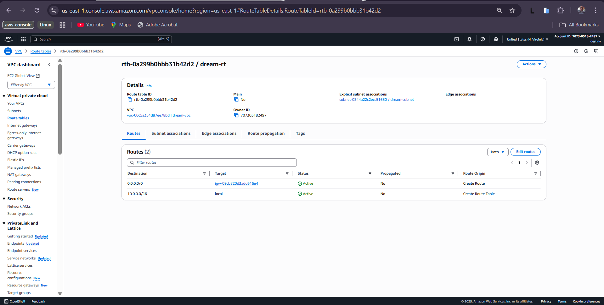

### EC2 configuration

An ecs instance was configure using the in vpc (dream-vpc) and in the public subnet (dream-subnet).
A security group with inbound rules that ensures the port 80 and 22 is open for internet and ssh access to the instance is also setup.
The instance is also configure to ensure a public ip is assigned to it.
Also a key is attache to the instance which us used by the deployment pipeline and to ssh into the server for the installation of docker.
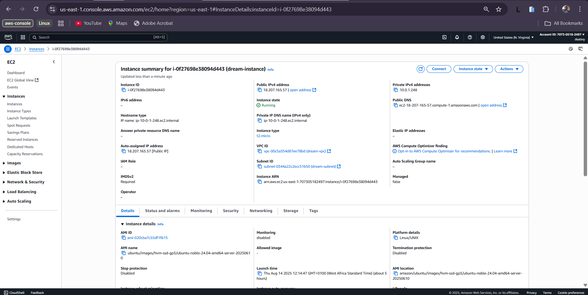

### Deployed Dream Vacation APP

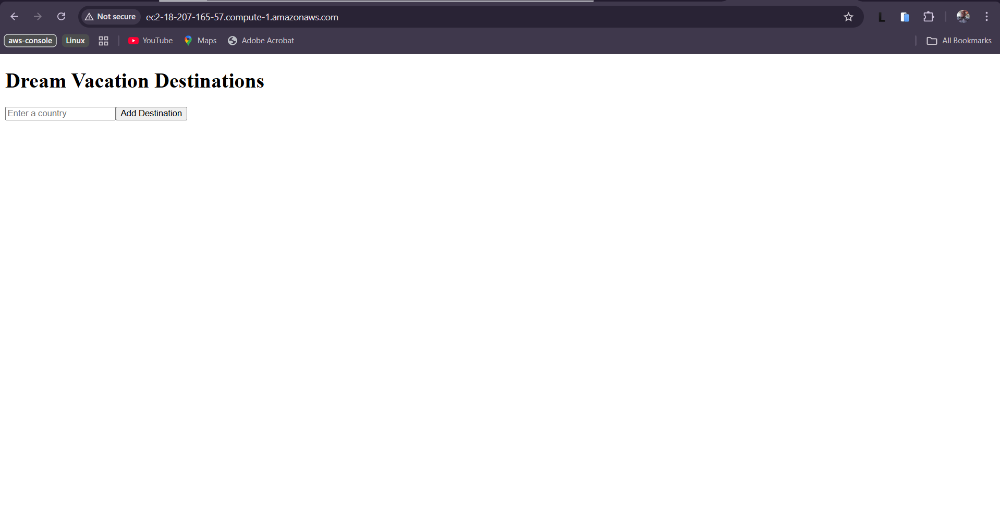

## EC2 Instance, Network and Cloud Configuration Using Terraform

Terraform was used to deploy the infrastructure for the ec2, network and cloudwatch and it was added to the CD pipeline.

The images shown below are the outcome of the terraform deployment:

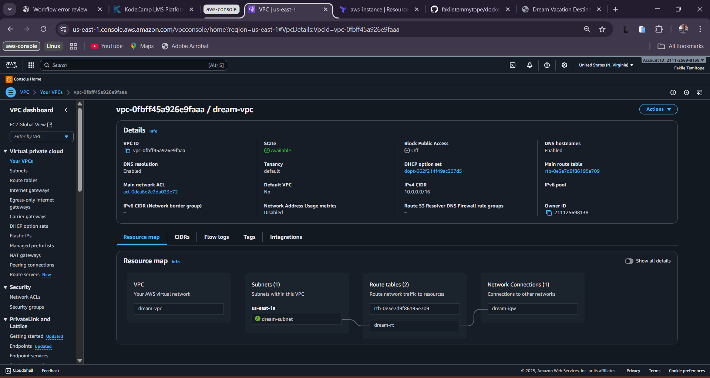

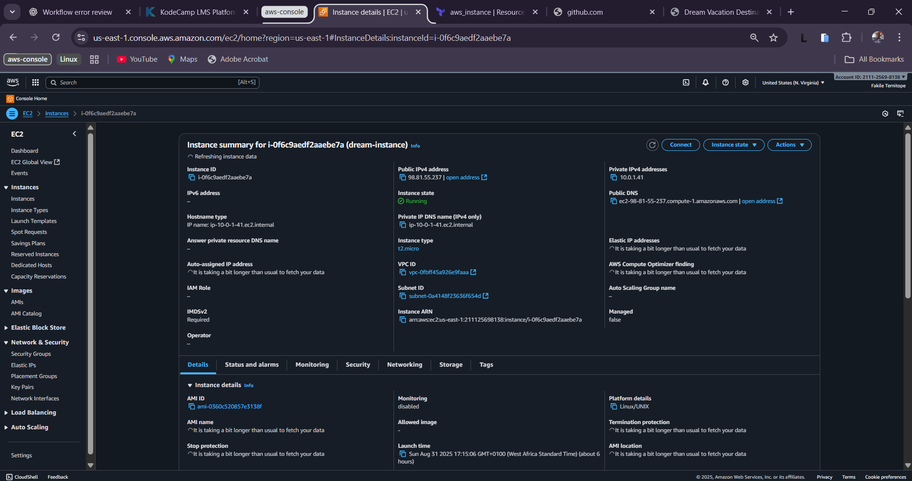

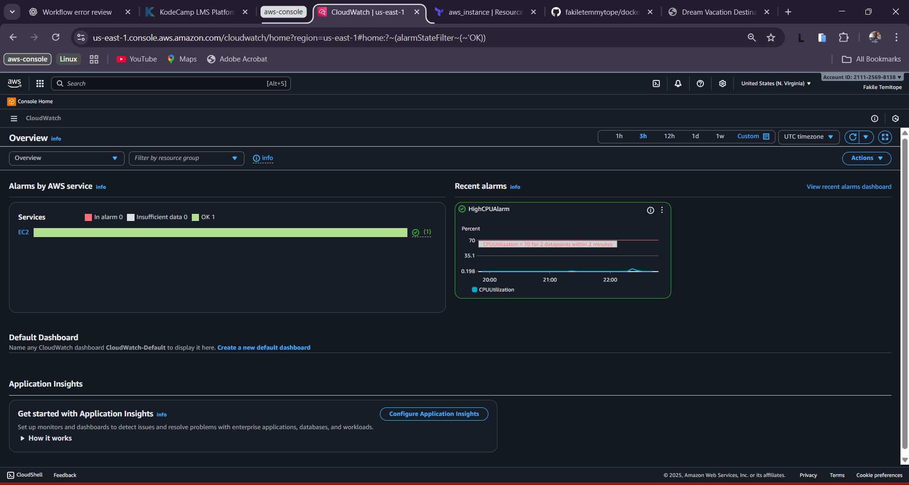

The code snippet for the terraform deployment are:

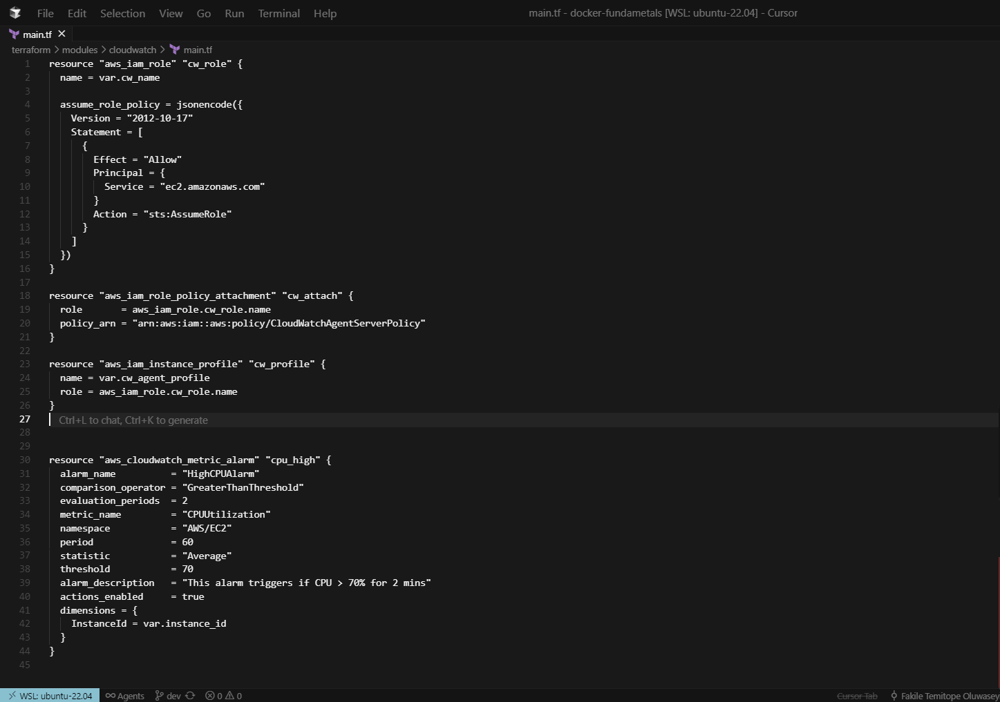

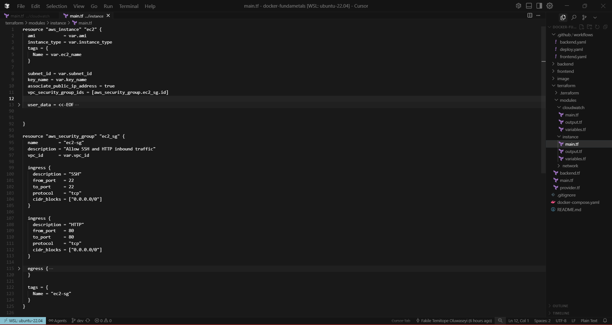

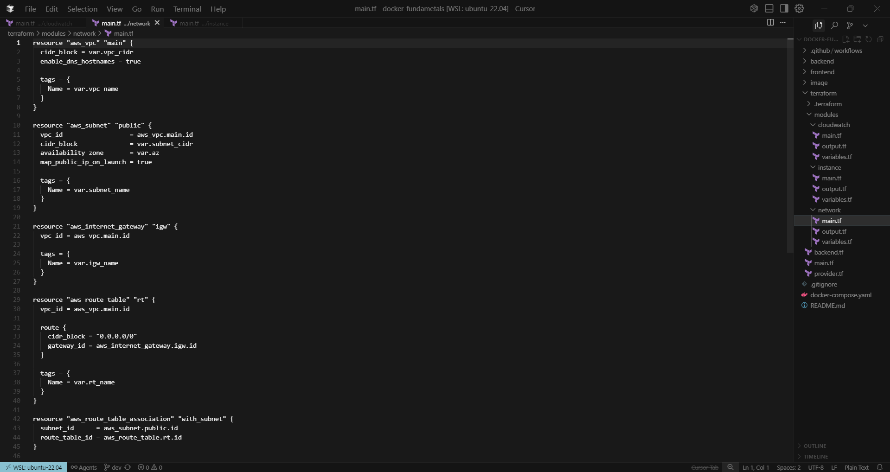

The output of the deployment using terraform is shown below:


